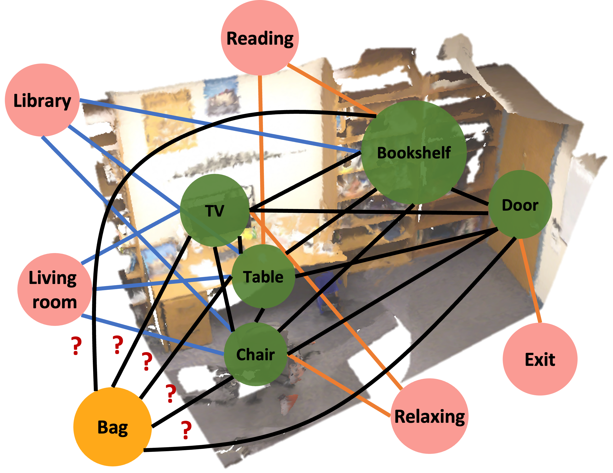
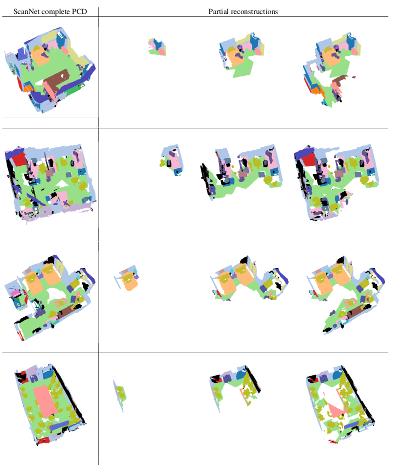
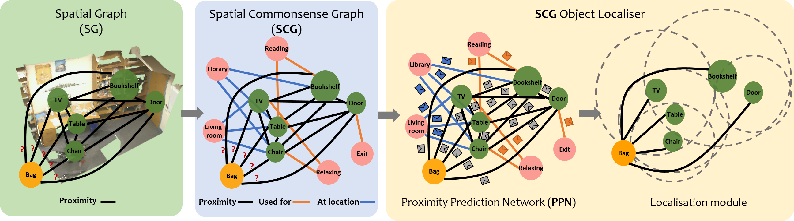

# [Spatial Commonsense Graph for Object Localisation in Partial Scenes](http://fgiuliari.github.io/projects/SpatialCommonsenseGraph/)
### [Project Website](http://fgiuliari.github.io/projects/SpatialCommonsenseGraph/)


### This repo contains the code and the dataset for our paper **[Spatial Commonsense graph for Object Localisation in Partial Scenes](https://arxiv.org/abs/2203.05380), Accepted at CVPR 2022**


## Abstract

We solve object localisation in partial scenes, a new problem of estimating the unknown position of an object (e.g. where is the bag?) given a partial 3D scan of a scene. The proposed solution is based on a novel scene graph model, the Spatial Commonsense Graph (SCG), where objects are the nodes and edges define pairwise distances between them, enriched by concept nodes and relationships from a commonsense knowledge base. This allows SCG to better generalise its spatial inference over unknown 3D scenes. The SCG is used to estimate the unknown position of the target object in two steps: first, we feed the SCG into a novel Proximity Prediction Network, a graph neural network that uses attention to perform distance prediction between the node representing the target object and the nodes representing the observed objects in the SCG; second, we propose a Localisation Module based on circular intersection to estimate the object position using all the predicted pairwise distances in order to be independent of any reference system. We create a new dataset of partially reconstructed scenes to benchmark our method and baselines for object localisation in partial scenes, where our proposed method achieves the best localisation performance.
# Table of Contents

 - [Dataset Generation](#dataset-preparation)
 - [SCG- Object Localiser](#scg---object-localiser)


***
## Dataset generation

The following section describe how to generate our dataset of partial pcd

### Retrieve the necessary data from ScanNet

First you need to sign the necessary agreement and obtain the **download-scannet.py** script to download the ScanNet data.
To do so follow the instruction in the original [ScanNet repository](https://github.com/ScanNet/ScanNet).


The necessary data to download is the **scannet_frames_25k.zip** and **Scannet v2** for both the training and validation set
next you should organize your folder structure so that in main folder you have:
```
This Repo
 |
 |--scannet_25_k\
 |  |
 |  |--scene0000_00\
 |  |  |
 |  |  |--color\
 |  |  |  |-- 0000000.jpg
 |  |  |  |-- 0000100.jpg
 |  |  |  |-- ...
 |  |  |-- depth\
 |  |  |  |-- 0000000.jpg
 |  |  |  |-- 0000100.jpg
 |  |  |  |-- ...
 |  |  |-- instance\
 |  |  |  |-- 0000000.jpg
 |  |  |  |-- 0000100.jpg
 |  |  |  |-- ...
 |  |  |-- label\
 |  |  |  |-- 0000000.jpg
 |  |  |  |-- 0000100.jpg
 |  |  |  |-- ...
 |  |  |-- etc
 |  |  |-- etc
 |  |--scene0000_01\
 |  |  |-- color\
 |  |  |-- depth\
 |  |  |-- ...\
 |  ...
 |
 |--scans\
 |  |--scene0000_00\
 |  |  |-- scene0000_00.txt
 |  |  |-- scene0000_00.aggregation.json
 |  |  |-- scene0000_00_vh_clean_2.0.010000.segs.json
 |  |  |-- scene0000_00_vh_clean_2.labels.ply
 |  |  |-- scene0000_00_vh_clean_2.ply
 |  |  
 |  |--scene0000_01\
 |  |  |-- scene0000_01.txt
 |  |  |-- scene0000_01.aggregation.json
 |  |  |-- scene0000_01_vh_clean_2.0.010000.segs.json
 |  |  |-- scene0000_01_vh_clean_2.labels.ply
 |  |  |-- scene0000_01_vh_clean_2.ply

```

### Processing the data

To process the data we will use [ray](https://docs.ray.io/en/latest/index.html) to handle the multiprocessing on multiple clusters. Ray can also be used on single machine. If you have troubles running it, it should be easy to convert the code to use the python standard multiprocessing library.

This processing steps will take some hours to run, please be patient.

#### 1) Preparing the annotated ply files

In this step we will create the scene pcd with semantic and instance information (the one provided by scannet do not directly provide the information regarding the instances)

```bash
python DATASET_GENERATION/1.created_annotated_ply.py
```


#### 2) Creating the point cloud for the partial scenes

```bash
python DATASET_GENERATION/2.create_partial_pcd.py
```


#### 3) Create the jsons

```bash
python DATASET_GENERATION/3.create_partial_jsons
```

### Conceptnet data


The data folder contains the files with the information to create the SCGs

 . **cnet_data.pth** - contains a dict with the related concepts for each object class

 . **cnet_embeddings.pth** - contains a dict with the pretrained embedding for each related concept

 . **nyu_labels.pth** - contains the mapping from the object class name to a unique integer

 . **cnet_labels.pth** - contains the mapping from the concept name to a unique integer

***
## SCG - Object Localiser


Code for our **SCG-OL** will be released soon!
